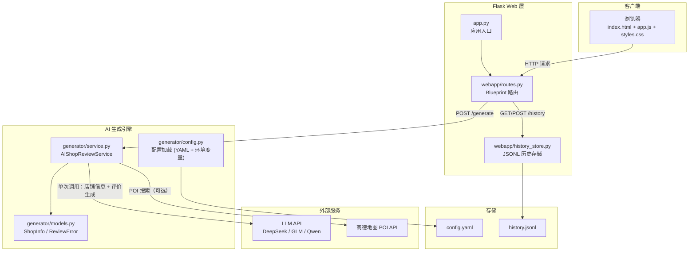

# Rating Generator

基于大语言模型的探店评价生成器。输入店铺名称，自动生成口语化、真实的消费评价，适用于大众点评、小红书等平台风格的种草文案。

## 功能

- **一键生成** — 输入店名，选择字数范围，即刻生成评价
- **高德地图接入** — 可选接入高德 POI 搜索 API，自动补充店铺真实信息
- **单次 API 调用** — 店铺搜索与评价生成合二为一，响应更快
- **历史记录** — 浏览器端自动保存 + 服务端 JSONL 持久化，支持复制和清空
- **Docker 部署** — 预构建镜像发布在 ghcr.io，拉取即用

## 安装部署

### 方式 1：Docker 部署（推荐）

镜像发布在 [GitHub Container Registry](https://github.com/1104381746/Rating-Generator/pkgs/container/rating-generator)，拉取即用。

**基础部署**

```bash
docker run -d \
  --name rating-generator \
  -p 5200:5200 \
  -v $(pwd)/logs:/app/logs \
  -e RG_API_KEY=sk-your-api-key \
  -e RG_API_BASE_URL=https://api.deepseek.com \
  -e RG_MODEL_NAME=deepseek-v4-flash \
  -e RG_AMAP_API_KEY=your-amap-key \
  -e RG_AMAP_CITY=深圳 \
  ghcr.io/1104381746/rating-generator:latest
```

`docker run` 参数说明：

- `-p 5200:5200` — 将容器端口映射到宿主机，按需调整
- `-v $(pwd)/logs:/app/logs` — 持久化日志文件
- `-e RG_API_KEY` — API 密钥
- `-e RG_API_BASE_URL` — API 接口地址
- `-e RG_MODEL_NAME` — 模型名称
- `-e RG_AMAP_API_KEY` — 高德地图 Key（可选）
- `-e RG_AMAP_CITY` — 限定城市（可选）

**Docker Compose 部署**

创建 `docker-compose.yml` 文件：

```yaml
services:
  rating-generator:
    image: ghcr.io/1104381746/rating-generator:latest
    container_name: rating-generator
    restart: unless-stopped
    ports:
      - "5200:5200"
    environment:
      - TZ=Asia/Shanghai
      - RG_API_KEY=sk-your-api-key
      - RG_API_BASE_URL=https://api.deepseek.com
      - RG_MODEL_NAME=deepseek-v4-flash
    volumes:
      - ./logs:/app/logs
```

启动服务：

```bash
docker compose up -d
```

查看日志：

```bash
docker compose logs -f
```

停止服务：

```bash
docker compose down
```

**数据持久化说明**

| 挂载路径 | 说明 |
|---------|------|
| `/app/logs` | 应用日志目录 |

> 日志文件统一输出到挂载的 `./logs` 目录下，历史生成记录存储在 `history.jsonl` 中。如需在容器重建时保留历史记录，建议将 `history.jsonl` 也挂载到宿主机。

### 方式 2：本地 Python 部署

```bash
pip install -r requirements.txt
cp config.yaml.example config.yaml   # 编辑填入 API Key
python app.py
```

## 配置说明

所有配置集中在 `config.yaml`。Docker 部署时也可通过环境变量设置。

### 环境变量（Docker）

以下环境变量优先级高于 `config.yaml`：

| 变量 | 对应配置 |
|------|---------|
| `RG_API_KEY` | `api.api_key` |
| `RG_API_BASE_URL` | `api.base_url` |
| `RG_MODEL_NAME` | `api.model_name` |
| `RG_AMAP_API_KEY` | `amap.api_key` |
| `RG_AMAP_CITY` | `amap.city` |

## API 兼容性

兼容 OpenAI 接口协议的大模型均可使用：

- [DeepSeek](https://platform.deepseek.com/) — `https://api.deepseek.com`
- [智谱 GLM](https://open.bigmodel.cn/) — `https://open.bigmodel.cn/api/paas/v4`
- [通义千问](https://dashscope.aliyun.com/) — `https://dashscope.aliyuncs.com/compatible-mode/v1`
- 其他兼容 OpenAI 协议的 API 网关

## 架构图



## 技术栈

| 层次 | 技术 |
|------|------|
| 后端 | Flask 3.x（工厂模式 + Blueprint）|
| AI | OpenAI Python SDK |
| 校验 | Pydantic v2 |
| 配置 | PyYAML |
| 前端 | 原生 JavaScript |
| 地图 | 高德 POI 搜索 API |
| 部署 | Docker / Docker Compose |

## 开源协议

[MIT](LICENSE)
